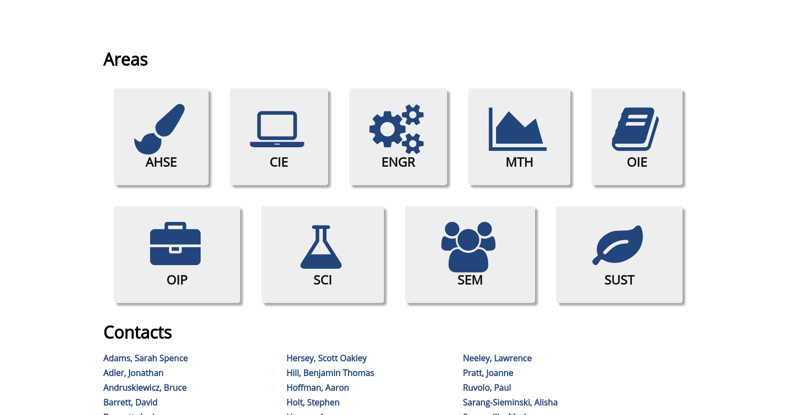
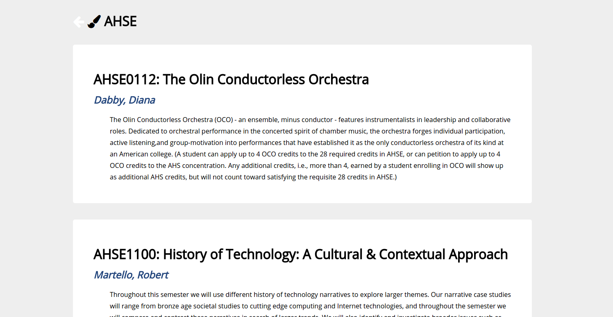

# HtL Lab 1

This is a [Flask](http://flask.pocoo.org) server that implements a minimal web-based interface to the Olin College
2016-2017 course catalog. The course data is scraped from the <olin.edu> web site.


## Requirements

Python 3 is required to run this program.
You can test whether Python 3 is installed on your laptop by running `python3` in the bash (shell) command line.


## Setup

```
$ pip3 install flask
$ pip3 install pandas
```


## Usage

1. Run `$ python3 server.py`
2. Browse to <http://127.0.0.1:5000/>. (Running `server.py` also prints this URL.)


## Directory Structure

`server.py` is a web application, written using the Flask web framework.
See [here](http://flask.pocoo.org) for information on using Flask.
The application uses [pandas](http://pandas.pydata.org) to read the (CSV) data file,
and to filter the list of courses down to specific areas.

`templates/*.html` are the HTML templates that are served in response to HTTP requests to the server.
See the Flask documentation for more information about how this works.
These are Jinja templates; read [here](http://jinja.pocoo.org) for information about Jinja.

`data/` contains data files. This is currently limited to:

`data/olin-courses-16-17.csv` is [CSV](https://en.wikipedia.org/wiki/Comma-separated_values) file that lists the courses.
See the first line of the file itself for a description of its columns.

`scripts/scrape_course_catalog.py` scrapes the <olin.edu> web site to create the data file.
This script makes heavy use of [pandas](http://pandas.pydata.org).
You shouldn't need to run this – in fact, running it too often may look like an attack on the web site.
As with all web scraping, this script is fragile – a minor change to the olin.edu web design or URL format
could break it with no warning.

## Extension Documentation

### Improvements to Visual Aesthetics

I added CSS to the templates in order to make the site prettier and more readable.



On the homepage, I used flexbox to turn the list of links into a grid of buttons that aligns itself automatically with the width of the page.  I also assigned each link an icon from [Font Awesome](http://fontawesome.io/) to be more visual-based.  This required creating a dictionary assigning each course area to an icon, and passing it into the template as an argument to be used.

For the contacts list, I also used flexbox to create columns of names, an improvement over the single paragraph block from before.



On the content screen for each course area, I changed the background of the page and each list item.  I added padding and spacing around lines and paragaphs, and changed the font type and size for readability.  I also added a header.

### Improvements to Functionality

First, I added a back button to the top of each content page, which links the user back to the main navigational page of the site.  Then, I created an additional set of content pages, in which clicking on an instructor's name on the home page or on the course-areas page takes you to a list of all classes taught by that professor.

## Contributors

Written by Oliver Steele <oliver.steele@olin.edu>.

Additions by Anne LoVerso <anne@loverso.org>.


## License

This code is made available under the MIT License
